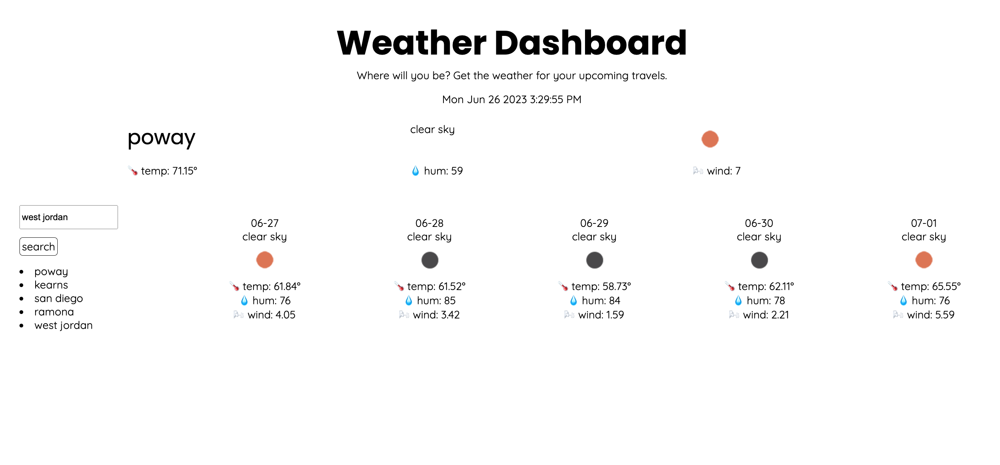
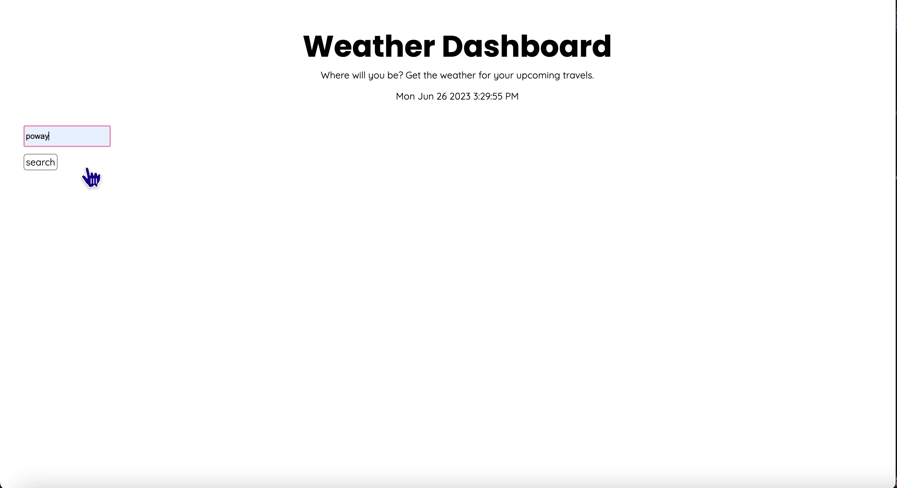
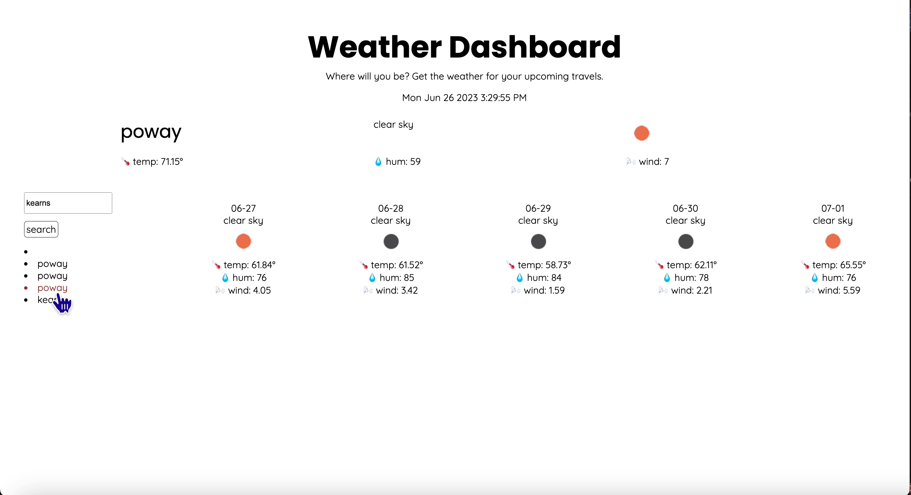

# 5 Day Weather Forecast
A minimalistic webpage that displays the weather for the upcoming 5 days in the city of your choice.

## Description

This is a webapp made using CSS, JavaScript and HTML. The purpose is to view weather predictions for the next 5 days as well as the current weather in a city of one's choice. It utilizes 3rd party API from OpenWeather. 

## Table of Contents

1. [Team](#team)
2. [Installation](#installation)
3. [Usage](#usage)
4. [Tests](#tests)
5. [Bugs](#bugs)
6. [Questions](#questions)
7. [Contribution Guidelines](#contribution-guidelines)
8. [License](#license)

## Team

---

The app was created by myself, Janica Jackson. Though there are many just like it out there.

_Other tools utilized:_

OpenWeather API: https://openweathermap.org/

## Installation

---

One must navigate to the GitHub pages URL in order to view the application. There is no further installation required by the user. The GitHub pages URL can be found here: https://janicajensen.github.io/5-day-forecast/ 

## Usage

---
The user will be presented with a search bar in which they should type the name of a city. This should be spelled correctly in order to obtain accurate results. Once the user has typed a city, they must click the "search" button. Upon clicking the search button, the user will be presented with the weather for today in the desired city, and then 5 boxes beneath it will display the weather for the upcoming days. The user will be able to see the current temperature, the humidity, the wind speed, and an icon that represents the current conditions with a minimalistic logo (provided by OpenWeather) and a one - two word description of the conditions.

The user will also be presented with a list of th elast 5 cities they searched, each of which are clickable and will generate the weather readouts for the chosen city.

## Tests

---

There are no tests for this app. 

## Bugs

---

There are no actual bugs, the app functions as it should. However, when window size is reduced fully, the 'current conditions' of today's weather will overlap with the name of the city in the bigWeatherCard, this is due to the large size of the cityName element and having used display:grid. It is also not that cute of a page, but the requirements did not state it had to meet any specific design princinples and I am just trying to learn here so, please forgive the black and white. 

In addition, the app only shows the last 5 cities that the user searched, this was an aesthetic choice, as I did not want a huge list running down the page or a scrollbar on the side, so I capped it at 5 cities, this is done in a loop in the JS. 

Also not a bug but something worth mentioning, I'm sure there is a way to make it so that you do not have to write the functions 5 different times to pull JSON from different lists, but I couldn't think of an obvious way to do it that actually worked and it became less time consuming for me to just copy the functions and change the numbers, so that's what I went with. I know there has to be a way to loop it, I just haven't learned it yet. That is why you will see "getWeather", "getFutureWeather1,2,3,4,5" and the same for displayWeather. 

## Questions

---

Please refer any questions to: janicajackson@gmail.com

**GitHub profile:** https://github.com/janicajensen

## Contribution Guidelines

---

If anyone wishes to contribute to this project, they may find the GitHub repository at https://github.com/JanicaJensen/5-day-forecast and they are welcome to create a fork.

## License

---

This project is covered under the MIT license.
More info can be found by clicking the badge above the description.

